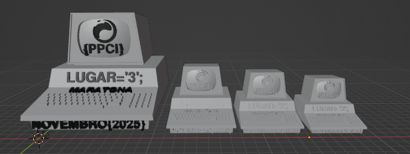
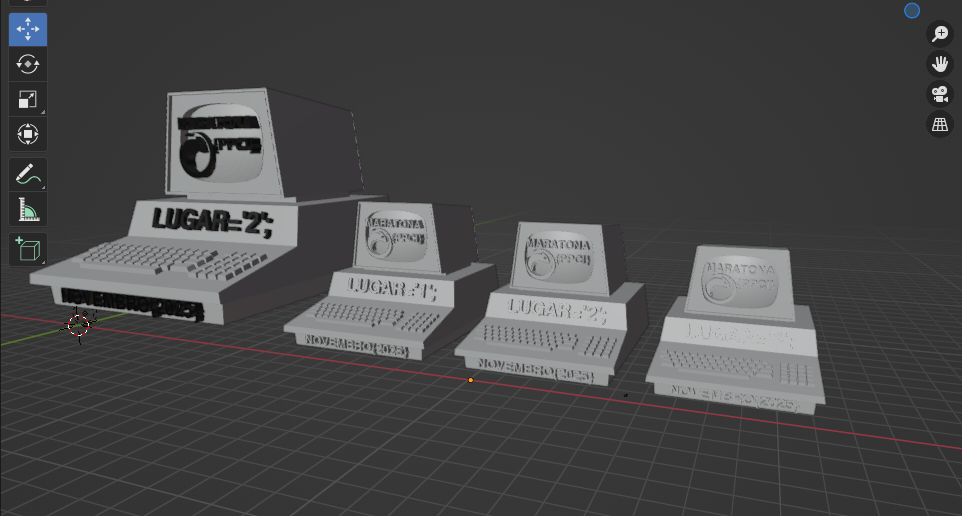
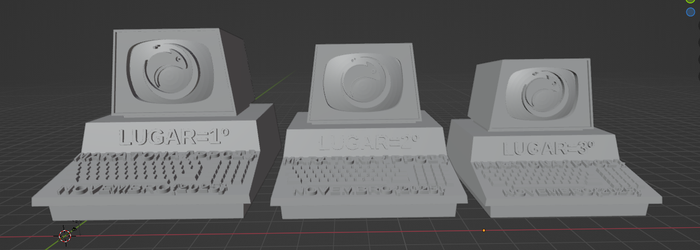
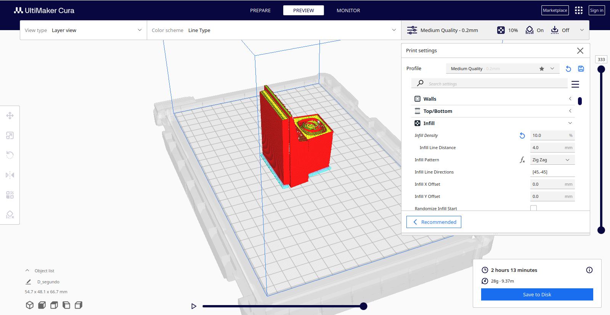

# Trofeu da Maratona PPCI

## 1. Modelos V3

- Primero lugar: 55% do tamanho do modelo 3D original
- Segundo lugar: 50% do tamanho do modelo 3D original
- Terceiro lugar: 45% do tamanho do modelo 3D original

## 2. Modelos V2

- Primero lugar: 55% do tamanho do modelo 3D original
- Segundo lugar: 50% do tamanho do modelo 3D original
- Terceiro lugar: 45% do tamanho do modelo 3D original

Problemas com a impressão das letras

## 3. Modelos V1

- Primero lugar: 55% do tamanho do modelo 3D original
- Segundo lugar: 50% do tamanho do modelo 3D original
- Terceiro lugar: 45% do tamanho do modelo 3D original

Problemas com a impressão das letras

## 4. Como imprimir

Wall top/botton: 2
Infill Density: 10%
